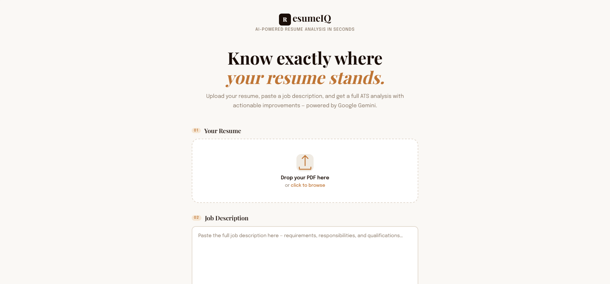
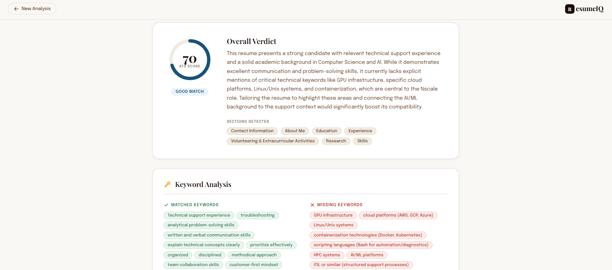
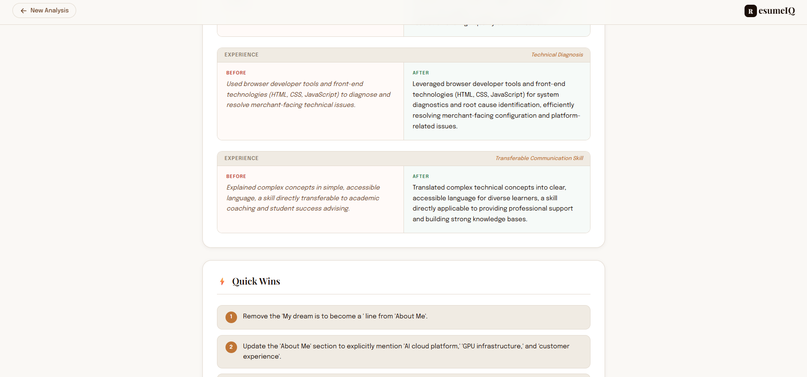

<div align="center">

# ResumeIQ — AI Resume Analyzer

**Paste your resume. Paste a job description. Get an instant ATS analysis powered by Google Gemini 2.5 Flash.**

[](https://python.org)
[](https://fastapi.tiangolo.com)
[](https://aistudio.google.com)
[](LICENSE)
[](https://render.com)

[Live Demo](https://resumeiq-ai-analyzer.onrender.com) · [Report a Bug](https://github.com/cryptic91/ResumeIQ_AI-Analyzer/issues) · [Request a Feature](https://github.com/cryptic91/ResumeIQ_AI-Analyzer/issues)

</div>

---

## Screenshots

<div align="center">

### Upload Screen


### ATS Score & Keyword Analysis


### Before & After Rewrites + Quick Wins


</div>

---

## What is ResumeIQ?

ResumeIQ is a full-stack web application that analyzes your resume against any job description and gives you a detailed, AI-powered report — just like a real recruiter would. It tells you your ATS compatibility score, which keywords you're missing, what to rewrite, and what quick changes will make the biggest difference.

Everything runs in your browser. Your PDF is never stored.

---

## Features

| Feature | Description |
|---|---|
| **ATS Score** | 0–100 compatibility score with animated ring |
| **Overall Verdict** | Executive summary of your resume's fit |
| **Keyword Analysis** | Matched vs. missing keywords from the job description |
| **Strengths & Weaknesses** | Honest, evidence-based feedback |
| **Section Improvements** | Targeted suggestions for every section |
| **Before / After Rewrites** | Side-by-side rewrite examples with stronger language |
| **Quick Wins** | 5-minute fixes for an immediate score boost |
| **Privacy First** | PDF processed in memory via `tempfile` — never stored |

---

## Tech Stack

| Layer | Technology |
|---|---|
| **Backend** | Python 3.11+, FastAPI, Uvicorn |
| **AI Model** | Google Gemini 2.5 Flash (`google-genai` SDK) |
| **PDF Parsing** | PyPDF |
| **Frontend** | Vanilla HTML, CSS, JavaScript (zero frameworks) |
| **Fonts** | Playfair Display + Epilogue (Google Fonts) |
| **Hosting** | Render |

---

## Project Structure

```
ResumeIQ_AI-Analyzer/
│
├── backend/
│   ├── main.py              # FastAPI app — routes, PDF extraction, static serving
│   ├── analyzer.py          # Gemini AI analysis logic
│   ├── requirements.txt     # Python dependencies
│   ├── .env                 # Your local API key (never committed)
│   └── .env.example         # Template — copy this to .env
│
├── frontend/
│   ├── index.html           # Single-page app (upload + results screens)
│   └── static/
│       ├── css/style.css    # Full design system — warm editorial theme
│       └── js/app.js        # Form handling, API calls, result rendering
│
├── render.yaml              # Render deployment blueprint
├── .gitignore
└── README.md
```

---

## Getting Started Locally

### Prerequisites

- Python 3.11 or higher
- A free [Google Gemini API key](https://aistudio.google.com/app/apikey)

### 1 — Clone the repo

```bash
git clone https://github.com/cryptic91/ResumeIQ_AI-Analyzer.git
cd ResumeIQ_AI-Analyzer
```

### 2 — Set up Python environment

```bash
cd backend
python -m venv .venv

# Windows
.venv\Scripts\activate

# macOS / Linux
source .venv/bin/activate
```

### 3 — Install dependencies

```bash
pip install -r requirements.txt
```

### 4 — Configure your API key

```bash
cp .env.example .env
```

Open `backend/.env` and replace the placeholder:

```env
GEMINI_API_KEY=your_actual_key_here
```

> Get a free key at [aistudio.google.com/app/apikey](https://aistudio.google.com/app/apikey)

### 5 — Run the server

```bash
uvicorn main:app --reload --port 8000
```

### 6 — Open the app

Visit **http://localhost:8000** in your browser.

---

## Deploying to Render (Free)

ResumeIQ can be deployed publicly on [Render](https://render.com) for free. Anyone with the URL will be able to use it.

> **Note:** The free tier sleeps after 15 minutes of inactivity. The first request after sleep takes ~30 seconds to wake up. Upgrade to a paid plan to keep it always-on.

### Step-by-step

**1. Push your code to GitHub**

Make sure your code is pushed to `https://github.com/cryptic91/ResumeIQ_AI-Analyzer`.

**2. Create a Render account**

Go to [render.com](https://render.com) and sign up (free).

**3. Create a new Web Service**

- Click **New → Web Service**
- Connect your GitHub account and select the `ResumeIQ_AI-Analyzer` repo
- Render will auto-detect the `render.yaml` blueprint and fill in all settings

**4. Set the environment variable**

In the Render dashboard for your service:
- Go to **Environment → Add Environment Variable**
- Key: `GEMINI_API_KEY`
- Value: your Gemini API key

> Never hardcode your API key in the code or commit it to GitHub.

**5. Deploy**

Click **Deploy** — Render will build and start the app. You'll get a public URL like:

```
https://resumeiq-ai-analyzer.onrender.com
```

Share it with anyone!

### What render.yaml does

The `render.yaml` at the root of the repo tells Render:

```yaml
services:
  - type: web
    name: resumeiq-ai-analyzer
    runtime: python
    rootDir: backend           # run from the backend folder
    buildCommand: pip install -r requirements.txt
    startCommand: uvicorn main:app --host 0.0.0.0 --port $PORT
    envVars:
      - key: GEMINI_API_KEY
        sync: false            # must be set manually in dashboard
```

Every time you push to GitHub, Render automatically redeploys.

---

## API Reference

### `POST /analyze`

Analyzes a resume PDF against a job description.

**Request** — `multipart/form-data`

| Field | Type | Description |
|---|---|---|
| `resume` | File (PDF) | The resume to analyze (max 10 MB) |
| `job_description` | String | The full job description text |

**Response** — `application/json`

```json
{
  "ats_score": 74,
  "overall_verdict": "Strong technical background but missing several key JD terms...",
  "sections_found": ["Summary", "Experience", "Skills", "Education"],
  "matched_keywords": ["Python", "REST API", "Docker"],
  "missing_keywords": ["Kubernetes", "CI/CD", "Terraform"],
  "strengths": ["Quantified achievements in experience section", "..."],
  "weaknesses": ["No mention of cloud platforms", "..."],
  "improvements_by_section": {
    "Experience": ["Add metrics to bullet points", "..."],
    "Skills": ["Group skills by category", "..."]
  },
  "before_after_rewrites": [
    {
      "section": "Experience",
      "label": "Work Experience bullet",
      "before": "Worked on backend services",
      "after": "Designed and deployed 3 microservices handling 50k+ daily requests using FastAPI and Docker"
    }
  ],
  "quick_wins": ["Add 'Kubernetes' to your skills section", "..."]
}
```

**Error responses**

| Status | Meaning |
|---|---|
| `400` | Invalid file type or empty job description |
| `500` | API key not configured |
| `502` | Gemini API error |

---

## Environment Variables

| Variable | Required | Description |
|---|---|---|
| `GEMINI_API_KEY` | Yes | Your Google Gemini API key from AI Studio |

---

## Contributing

Contributions are welcome! Here's how:

1. Fork the repo
2. Create a feature branch: `git checkout -b feature/your-feature`
3. Commit your changes: `git commit -m "Add your feature"`
4. Push to the branch: `git push origin feature/your-feature`
5. Open a Pull Request

Please open an issue first for major changes.

---

## License

This project is licensed under the **MIT License** — see the [LICENSE](LICENSE) file for details.

---

## Author

**MD Rakibul Islam Shanto**
GitHub: [@cryptic91](https://github.com/cryptic91)

---

<div align="center">

Made with dedication · Powered by [Google Gemini](https://deepmind.google/technologies/gemini/)

</div>
